# Marketing Module Comprehensive Flowchart

## Overview
This flowchart represents the complete Marketing module architecture, including user interactions, data flow, and system components.

## Mermaid Flowchart

```mermaid
graph TB
    %% User Entry Points
    A[User Login] --> B{Authentication}
    B -->|Success| C[Admin Dashboard]
    B -->|Failed| A
    
    C --> D[Marketing Module]
    
    %% Marketing Dashboard Main Structure
    D --> E[Marketing Dashboard]
    E --> F[Overview Tab]
    E --> G[Campaigns Tab]
    E --> H[Templates Tab]
    E --> I[Analytics Tab]
    E --> J[Notifications Tab]
    
    %% Overview Tab Flow
    F --> F1[Metrics Display]
    F1 --> F2[Total Campaigns: 24]
    F1 --> F3[Active Promotions: 12]
    F1 --> F4[Loyalty Members: 3,690]
    F1 --> F5[Total Reach: 23.1K]
    
    F --> F6[Recent Campaigns List]
    F6 --> F7[Summer Veterinary Sale]
    F6 --> F8[New Customer Welcome]
    F6 --> F9[Holiday Special Offer]
    
    F --> F10[Quick Actions]
    F10 --> F11[Create Campaign]
    F10 --> F12[Template Management]
    F10 --> F13[Campaign Analytics]
    F10 --> F14[Client Notifications]
    
    %% Campaign Management Flow
    G --> G1[Campaign Management]
    G1 --> G2[Campaign List View]
    G2 --> G3[Filter & Search]
    G2 --> G4[Campaign Cards]
    
    G4 --> G5[Campaign Actions]
    G5 --> G6[Edit Campaign]
    G5 --> G7[Duplicate Campaign]
    G5 --> G8[Delete Campaign]
    G5 --> G9[Publish/Unpublish]
    G5 --> G10[View Analytics]
    
    G1 --> G11[Create New Campaign]
    G11 --> G12[Campaign Form]
    G12 --> G13[Template Selection]
    G13 --> G14[Hero Banner]
    G13 --> G15[Promo Card]
    G13 --> G16[Popup]
    
    G12 --> G17[Content Customization]
    G17 --> G18[Title & Description]
    G17 --> G19[Rich Text Content]
    G17 --> G20[Image Upload]
    G17 --> G21[Color Customization]
    G17 --> G22[CTA Configuration]
    
    G12 --> G23[Targeting Settings]
    G23 --> G24[Target Audience]
    G23 --> G25[Target Channels]
    G23 --> G26[Device Targeting]
    G23 --> G27[Time-based Targeting]
    
    G12 --> G28[Publishing Options]
    G28 --> G29[Immediate Publish]
    G28 --> G30[Scheduled Publish]
    G28 --> G31[Draft Mode]
    G28 --> G32[Auto-unpublish]
    
    G12 --> G33[Campaign Preview]
    G33 --> G34[Real-time Preview]
    G33 --> G35[Device Preview]
    G33 --> G36[Publish/Unpublish Toggle]
    
    %% Template Management Flow
    H --> H1[Template Management]
    H1 --> H2[Template List]
    H2 --> H3[Pre-built Templates]
    H2 --> H4[Custom Templates]
    
    H3 --> H5[Hero Banner Template]
    H3 --> H6[Promo Card Template]
    H3 --> H7[Popup Template]
    
    H1 --> H8[Create Template]
    H8 --> H9[Template Form]
    H9 --> H10[Template Name]
    H9 --> H11[Template Type]
    H9 --> H12[Default Styles]
    H9 --> H13[Required Fields]
    
    H1 --> H14[Template Actions]
    H14 --> H15[Edit Template]
    H14 --> H16[Delete Template]
    H14 --> H17[Duplicate Template]
    
    %% Analytics Flow
    I --> I1[Campaign Analytics]
    I1 --> I2[Performance Metrics]
    I2 --> I3[Views Count]
    I2 --> I4[Clicks Count]
    I2 --> I5[Conversions Count]
    I2 --> I6[Click-through Rate]
    I2 --> I7[Conversion Rate]
    
    I1 --> I8[Analytics Charts]
    I8 --> I9[Daily Stats]
    I8 --> I10[Performance Trends]
    I8 --> I11[Device Breakdown]
    I8 --> I12[Channel Performance]
    
    I1 --> I13[Event Tracking]
    I13 --> I14[View Events]
    I13 --> I15[Click Events]
    I13 --> I16[Conversion Events]
    I13 --> I17[Impression Events]
    
    %% Notifications Flow
    J --> J1[Client Notifications]
    J1 --> J2[Notification List]
    J2 --> J3[Email Notifications]
    J2 --> J4[Push Notifications]
    J2 --> J5[In-app Notifications]
    
    J1 --> J6[Create Notification]
    J6 --> J7[Notification Form]
    J7 --> J8[Title & Message]
    J7 --> J9[Notification Type]
    J7 --> J10[Priority Level]
    J7 --> J11[Scheduling]
    J7 --> J12[Target Audience]
    J7 --> J13[Rich Content]
    
    J1 --> J14[Notification Templates]
    J14 --> J15[Welcome Email]
    J14 --> J16[Promotion Push]
    J14 --> J17[Custom Templates]
    
    J1 --> J18[Notification Actions]
    J18 --> J19[Send Notification]
    J18 --> J20[Schedule Notification]
    J18 --> J21[Edit Notification]
    J18 --> J22[Delete Notification]
    
    %% Database Layer
    G12 --> DB1[(Database Layer)]
    H9 --> DB1
    I13 --> DB1
    J7 --> DB1
    
    DB1 --> DB2[campaign_templates]
    DB1 --> DB3[marketing_campaigns]
    DB1 --> DB4[campaign_analytics]
    DB1 --> DB5[campaign_schedules]
    DB1 --> DB6[client_notifications]
    DB1 --> DB7[notification_templates]
    DB1 --> DB8[marketing_user_roles]
    DB1 --> DB9[marketing_audit_logs]
    
    %% API Layer
    G12 --> API1[Marketing API]
    H9 --> API1
    I13 --> API1
    J7 --> API1
    
    API1 --> API2[Campaign CRUD]
    API1 --> API3[Template Management]
    API1 --> API4[Analytics Tracking]
    API1 --> API5[Notification System]
    API1 --> API6[File Upload Service]
    API1 --> API7[Validation Service]
    API1 --> API8[Auth Middleware]
    
    %% File Storage
    G20 --> FS1[Supabase Storage]
    FS1 --> FS2[Image Processing]
    FS2 --> FS3[Resize & Optimize]
    FS2 --> FS4[Format Conversion]
    FS2 --> FS5[Quality Adjustment]
    
    %% Authentication & Authorization
    B --> AUTH1[Auth Middleware]
    AUTH1 --> AUTH2[User Roles]
    AUTH2 --> AUTH3[Admin]
    AUTH2 --> AUTH4[Marketing Manager]
    AUTH2 --> AUTH5[Viewer]
    
    AUTH1 --> AUTH6[Permissions]
    AUTH6 --> AUTH7[Campaign Management]
    AUTH6 --> AUTH8[Template Management]
    AUTH6 --> AUTH9[Analytics Access]
    AUTH6 --> AUTH10[Notification Management]
    
    %% External Integrations
    J19 --> EXT1[External Services]
    EXT1 --> EXT2[Email Service]
    EXT1 --> EXT3[Push Notification Service]
    EXT1 --> EXT4[Analytics Service]
    
    %% Styling
    classDef userFlow fill:#e1f5fe,stroke:#01579b,stroke-width:2px
    classDef database fill:#f3e5f5,stroke:#4a148c,stroke-width:2px
    classDef api fill:#e8f5e8,stroke:#1b5e20,stroke-width:2px
    classDef storage fill:#fff3e0,stroke:#e65100,stroke-width:2px
    classDef auth fill:#fce4ec,stroke:#880e4f,stroke-width:2px
    
    class A,B,C,D,E,F,G,H,I,J userFlow
    class DB1,DB2,DB3,DB4,DB5,DB6,DB7,DB8,DB9 database
    class API1,API2,API3,API4,API5,API6,API7,API8 api
    class FS1,FS2,FS3,FS4,FS5 storage
    class AUTH1,AUTH2,AUTH3,AUTH4,AUTH5,AUTH6,AUTH7,AUTH8,AUTH9,AUTH10 auth
```

## Key Features Represented

### 1. **User Interface Flow**
- **Marketing Dashboard** with 5 main tabs
- **Overview** with metrics and quick actions
- **Campaign Management** with full CRUD operations
- **Template Management** for custom templates
- **Analytics** with real-time tracking
- **Notifications** for client engagement

### 2. **Campaign Lifecycle**
- **Creation** with template selection and customization
- **Content Management** with rich text and media
- **Targeting** with audience and device options
- **Publishing** with immediate or scheduled options
- **Analytics** with comprehensive tracking
- **Management** with edit, duplicate, and delete options

### 3. **Template System**
- **Pre-built Templates** (Hero Banner, Promo Card, Popup)
- **Custom Templates** with user-defined styles
- **Template Management** with CRUD operations
- **Required Fields** validation

### 4. **Analytics & Tracking**
- **Real-time Metrics** (views, clicks, conversions)
- **Performance Charts** with daily stats
- **Event Tracking** for user interactions
- **Device & Channel** breakdown

### 5. **Notification System**
- **Multiple Types** (Email, Push, In-app)
- **Scheduling** with future delivery
- **Templates** for consistent messaging
- **Targeting** with audience segmentation

### 6. **Database Architecture**
- **8 Core Tables** for comprehensive data management
- **Relationships** with foreign keys and constraints
- **Audit Logging** for compliance
- **Row Level Security** for data protection

### 7. **API Layer**
- **RESTful Endpoints** for all operations
- **Authentication** with JWT tokens
- **Authorization** with role-based permissions
- **Validation** with comprehensive error handling

### 8. **File Management**
- **Image Upload** with Supabase Storage
- **Processing** with resize and optimization
- **Security** with type and size validation
- **CDN** delivery for performance

## User Journey Examples

### Creating a Campaign
1. User clicks "Create Campaign" from Overview
2. Selects template type (Hero Banner, Promo Card, or Popup)
3. Customizes content (title, description, colors, CTA)
4. Uploads and processes images
5. Sets targeting and scheduling options
6. Previews campaign in real-time
7. Saves as draft or publishes immediately

### Managing Templates
1. User navigates to Templates tab
2. Views pre-built and custom templates
3. Creates new template with custom styles
4. Defines required fields and validation
5. Saves template for future use

### Tracking Analytics
1. User views Analytics tab
2. Sees real-time metrics and performance
3. Analyzes daily stats and trends
4. Tracks specific campaign performance
5. Exports data for reporting

This flowchart provides a complete visual representation of your Marketing module's architecture and user flows, making it easy to understand the system's capabilities and data flow.
