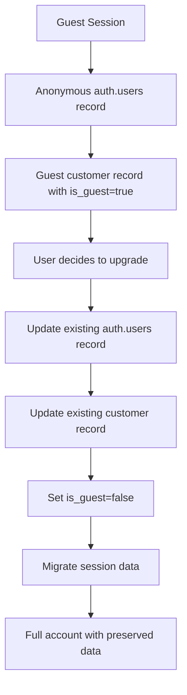

# Guest Account Upgrade Implementation Guide

## Overview

This guide provides a complete solution for upgrading guest accounts to full accounts without creating duplicate records, while preserving all guest session data (cart, preferences, analytics).

## Problem Solved

- **Issue**: PWA creates guest sessions via anonymous `auth.users` records, then creates new `auth.users` records when guests sign up, causing duplicates
- **Solution**: Update existing guest records instead of creating new ones
- **Benefits**: Preserves guest data, avoids duplicates, maintains referential integrity

## Architecture



## Implementation Steps

### 1. Database Setup

Run the SQL script to create the necessary functions and triggers:

```sql
-- Execute the guest_account_upgrade_solution.sql file
\i project/guest_account_upgrade_solution.sql
```

### 2. PWA Service Integration

The `guestUpgradeService.ts` provides two approaches:

#### Approach A: Direct Supabase Auth Update (Recommended)
```typescript
// Update existing auth.users record
const { data: authData, error: authError } = await supabase.auth.updateUser({
  email: upgradeData.email,
  password: upgradeData.password,
  data: { /* user metadata */ }
})

// Update existing customer record
const { data: updatedCustomer } = await supabase
  .from('customers')
  .update({
    email: upgradeData.email,
    is_guest: false,
    // ... other fields
  })
  .eq('user_id', user.id)
```

#### Approach B: Database Function (Alternative)
```typescript
// Use the database function for server-side logic
const result = await guestUpgradeService.upgradeGuestAccountViaFunction(upgradeData)
```

### 3. UI Integration

Use the `GuestUpgradeModal` component in your PWA:

```tsx
import GuestUpgradeModal from '../components/GuestUpgradeModal'

function MyComponent() {
  const [showUpgradeModal, setShowUpgradeModal] = useState(false)
  
  const handleUpgradeSuccess = (customer) => {
    console.log('Account upgraded:', customer)
    // Handle success (redirect, show message, etc.)
  }

  return (
    <>
      <button onClick={() => setShowUpgradeModal(true)}>
        Upgrade Guest Account
      </button>
      
      <GuestUpgradeModal
        isOpen={showUpgradeModal}
        onClose={() => setShowUpgradeModal(false)}
        onUpgradeSuccess={handleUpgradeSuccess}
      />
    </>
  )
}
```

## Key Features

### ✅ **No Duplicates**
- Updates existing `auth.users` record instead of creating new one
- Updates existing `customers` record instead of creating new one
- Preserves all foreign key relationships

### ✅ **Data Preservation**
- Cart items remain linked to the same user
- User preferences are maintained
- Analytics data is preserved
- All session data migrates seamlessly

### ✅ **Trigger Safety**
- Uses `ON CONFLICT` clauses to prevent duplicate inserts
- Handles race conditions gracefully
- Maintains referential integrity

### ✅ **User Experience**
- Seamless upgrade process
- Pre-fills form with existing guest data
- Clear error handling and validation
- Progress indicators during upgrade

## Database Functions

### `upgrade_guest_to_full_account()`
- Updates existing customer record
- Validates email uniqueness
- Marks account as no longer guest
- Returns success/error status

### `migrate_guest_session_data()`
- Migrates cart items, preferences, analytics
- Handles data migration safely
- Preserves all guest session data

### `upgrade_guest_account_api()`
- Combined function for complete upgrade
- Handles both customer update and data migration
- Returns comprehensive result

## Testing

### 1. Create Guest Account
```typescript
// Start as guest
await startGuestSession()
// Add items to cart, set preferences, etc.
```

### 2. Test Upgrade
```typescript
const upgradeData = {
  email: 'test@example.com',
  password: 'password123',
  first_name: 'John',
  last_name: 'Doe'
}

const result = await guestUpgradeService.upgradeGuestAccount(upgradeData)
console.log('Upgrade result:', result)
```

### 3. Verify Data Preservation
```sql
-- Check customer record
SELECT * FROM customers WHERE user_id = 'your-user-id';

-- Check cart items (if you have a cart table)
SELECT * FROM cart_items WHERE user_id = 'your-user-id';

-- Check analytics
SELECT * FROM pwa_analytics WHERE session_id = 'your-user-id';
```

## Error Handling

The solution handles common error scenarios:

- **Email already exists**: Validates email uniqueness before upgrade
- **Invalid guest account**: Checks if account is actually a guest
- **Auth update failure**: Handles Supabase Auth errors gracefully
- **Database constraints**: Uses proper conflict resolution
- **Network issues**: Provides retry logic and clear error messages

## Security Considerations

- **RLS Policies**: Ensures users can only upgrade their own accounts
- **Input Validation**: Validates all input data before processing
- **Password Security**: Relies on Supabase Auth for password handling
- **Data Integrity**: Maintains referential integrity throughout process

## Performance Considerations

- **Single Transaction**: All updates happen in one transaction
- **Efficient Queries**: Uses indexed columns for lookups
- **Minimal Data Transfer**: Only updates changed fields
- **Async Processing**: Non-blocking UI updates

## Migration from Current System

If you have existing duplicate records, you can clean them up:

```sql
-- Find duplicate customers
SELECT email, COUNT(*) 
FROM customers 
GROUP BY email 
HAVING COUNT(*) > 1;

-- Merge duplicate records (manual process)
-- Keep the record with the most recent activity
-- Update foreign keys to point to the kept record
-- Delete the duplicate record
```

## Monitoring and Maintenance

### Logs to Monitor
- Guest upgrade attempts
- Failed upgrades and reasons
- Data migration results
- Performance metrics

### Regular Maintenance
- Clean up old guest accounts (if needed)
- Monitor for failed upgrades
- Check data integrity
- Update RLS policies as needed

## Troubleshooting

### Common Issues

1. **"Guest account not found"**
   - Check if user is actually logged in as guest
   - Verify `is_guest = true` in customers table

2. **"Email already registered"**
   - Email is taken by another account
   - User needs to use different email or login to existing account

3. **"Auth update failed"**
   - Check Supabase Auth configuration
   - Verify user permissions
   - Check network connectivity

4. **"Customer update failed"**
   - Check RLS policies
   - Verify database permissions
   - Check for constraint violations

### Debug Queries

```sql
-- Check guest accounts
SELECT * FROM customers WHERE is_guest = true;

-- Check auth users
SELECT id, email, created_at FROM auth.users ORDER BY created_at DESC LIMIT 10;

-- Check for duplicates
SELECT email, COUNT(*) FROM customers GROUP BY email HAVING COUNT(*) > 1;
```

## Conclusion

This solution provides a robust, trigger-safe way to upgrade guest accounts without creating duplicates while preserving all guest session data. The implementation is production-ready and handles edge cases gracefully.

The key insight is to **update existing records** rather than **create new ones**, which maintains data integrity and provides a seamless user experience.


