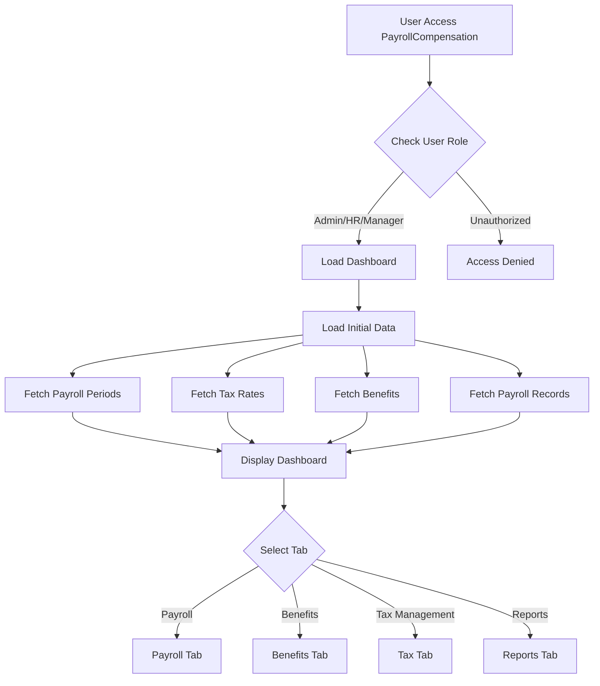
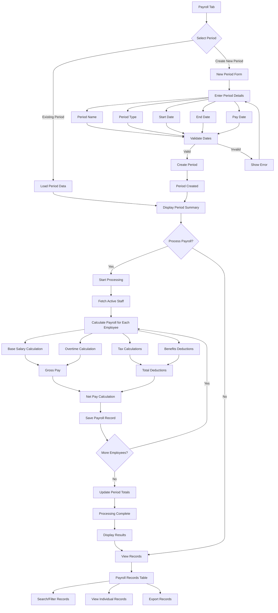
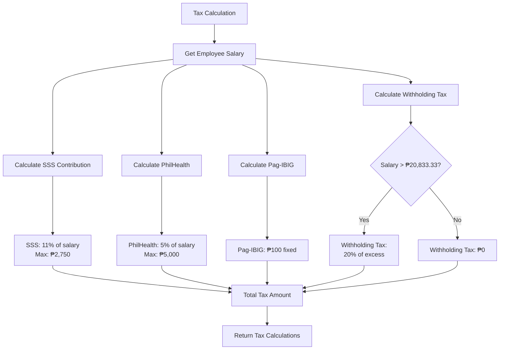
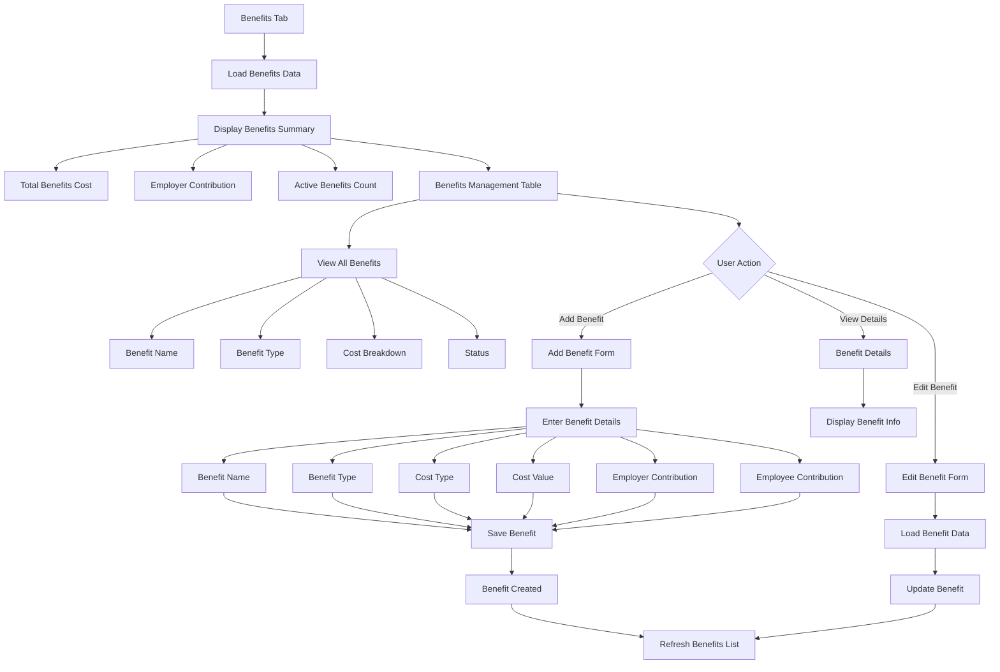
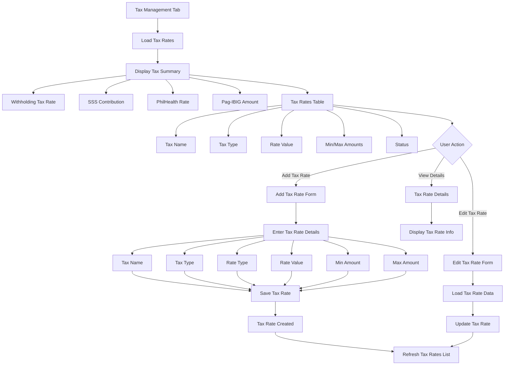
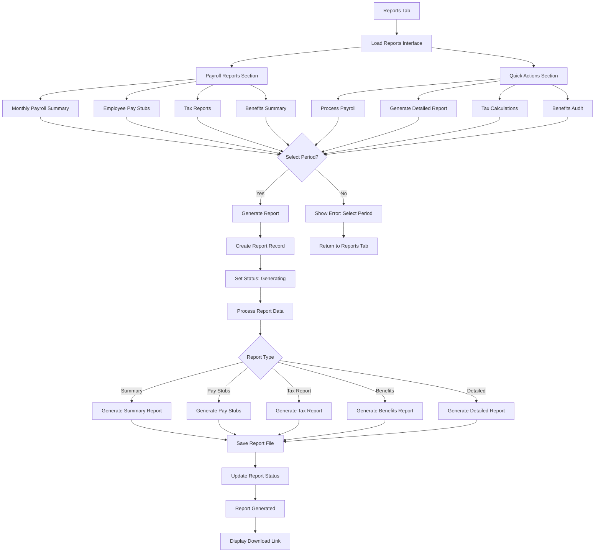
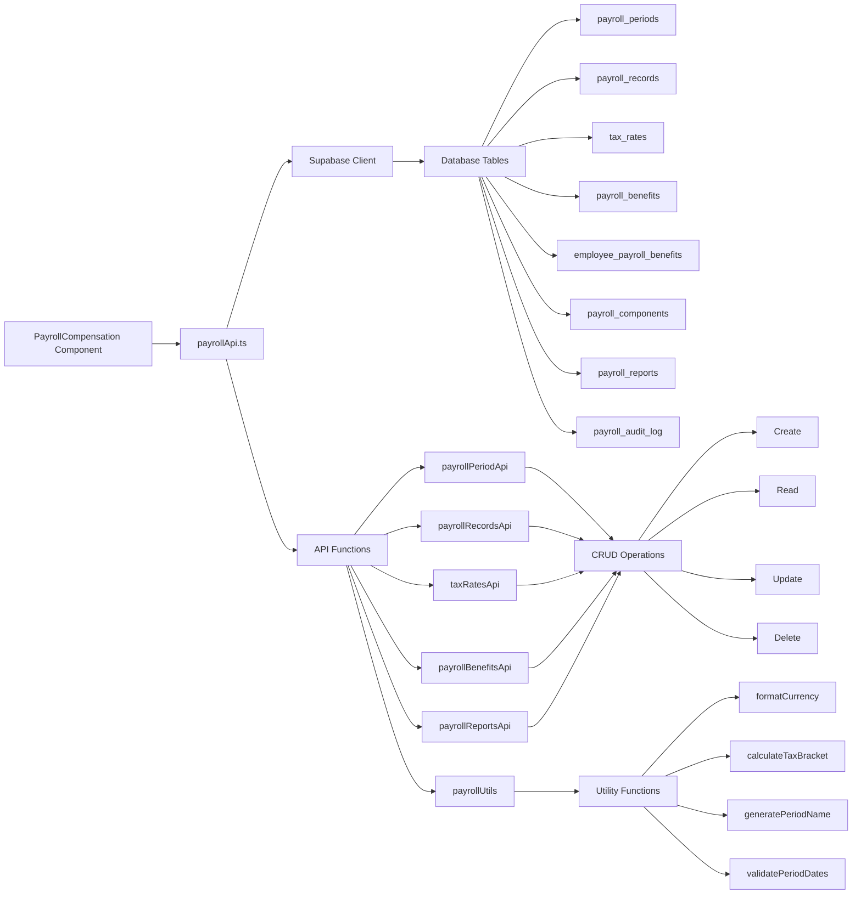
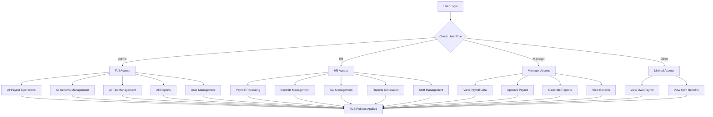
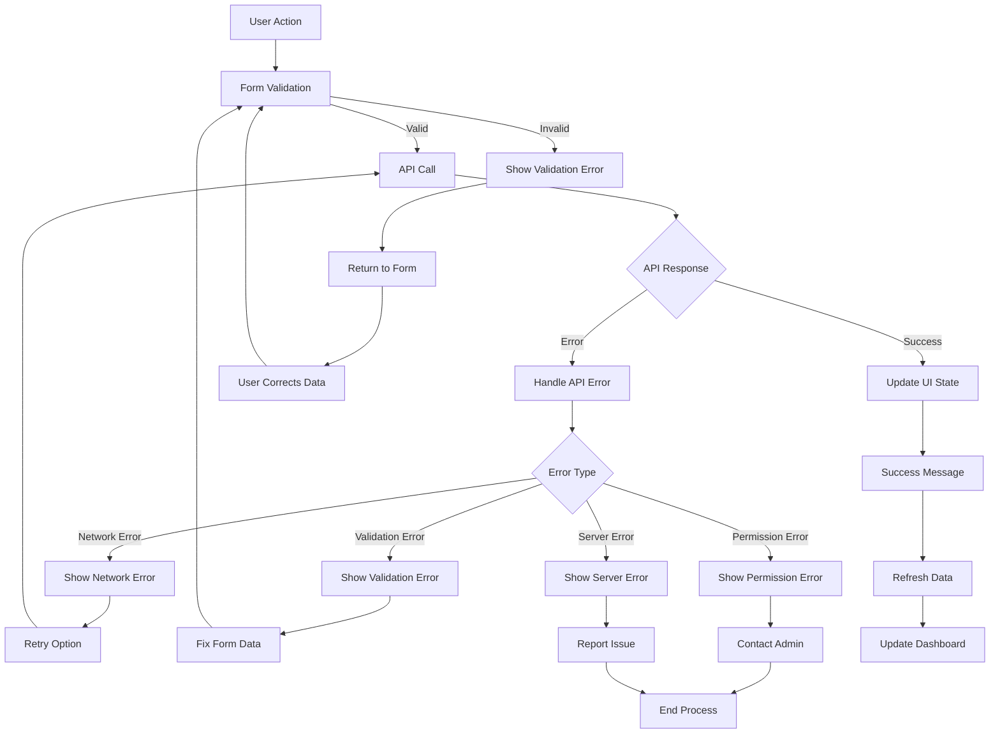

# PayrollCompensation System Flowchart

## Main System Workflow

## Payroll Processing Workflow

## Tax Calculation Workflow

## Benefits Management Workflow

## Tax Rates Management Workflow

## Reports Generation Workflow

## Data Flow Architecture

## User Role & Permission Flow

## Error Handling & Validation Flow

This comprehensive flowchart covers all the major workflows, data flows, and user interactions in your PayrollCompensation system. Each diagram shows a different aspect of the system, from the main user flow to technical implementation details.
