# SettingsPage.tsx - Comprehensive Feature Flowchart

## Mermaid Flowchart

```mermaid
flowchart TD
    A[SettingsPage Component] --> B[Settings Navigation]
    A --> C[General Settings]
    A --> D[Security & Privacy]
    A --> E[Notification Preferences]
    A --> F[Branch Management]
    A --> G[Data Management]
    A --> H[User Preferences]
    A --> I[Quick Actions]

    %% Settings Navigation
    B --> B1[General Settings Icon]
    B --> B2[Security & Privacy Icon]
    B --> B3[Notifications Icon]
    B --> B4[Data Management Icon]

    %% General Settings
    C --> C1[Application Configuration]
    C --> C2[Company Information]
    C --> C3[Localization Settings]
    C --> C4[Theme & Currency]
    
    C1 --> C1a[App Name]
    C1 --> C1b[Company Name]
    C1 --> C1c[Contact Email]
    C1 --> C1d[Support Phone]
    
    C3 --> C3a[Language Selection<br/>EN/FIL/CEB]
    C3 --> C3b[Timezone Selection<br/>Asia/Manila/Singapore/UTC]
    
    C4 --> C4a[Theme: Light/Dark/Auto]
    C4 --> C4b[Currency: PHP/USD/EUR]

    %% Security & Privacy
    D --> D1[Password Reset Management]
    D --> D2[Change Password]
    D --> D3[Two-Factor Authentication]
    
    D1 --> D1a[View Reset Requests]
    D1 --> D1b[Approve Requests]
    D1 --> D1c[Generate Temp Passwords]
    D1 --> D1d[Send Email Notifications]
    D1 --> D1e[Request Statistics<br/>Pending/Approved/Total]
    
    D2 --> D2a[Current Password Input]
    D2 --> D2b[New Password Input]
    D2 --> D2c[Password Visibility Toggle]
    
    D3 --> D3a[Enable/Disable 2FA]
    D3 --> D3b[Setup Authenticator App]
    D3 --> D3c[Setup Email 2FA]

    %% Notification Preferences
    E --> E1[Sales Notifications]
    E --> E2[Inventory Alerts]
    E --> E3[Staff Updates]
    E --> E4[Report Generation]
    E --> E5[Critical SMS Alerts]
    E --> E6[Mobile Push Notifications]
    
    E1 --> E1a[Toggle On/Off]
    E2 --> E2a[Toggle On/Off]
    E3 --> E3a[Toggle On/Off]
    E4 --> E4a[Toggle On/Off]
    E5 --> E5a[Toggle On/Off]
    E6 --> E6a[Toggle On/Off]

    %% Branch Management
    F --> F1[View Branches]
    F --> F2[Add New Branch]
    F --> F3[Export Branches]
    F --> F4[Branch Configuration]
    
    F1 --> F1a[Branch List Display]
    F1 --> F1b[Branch Details<br/>Name/Address/City/Phone/Manager]
    F1 --> F1c[Active/Inactive Status]
    
    F2 --> F2a[Branch Name Input]
    F2 --> F2b[Address Input]
    F2 --> F2c[City Input]
    F2 --> F2d[Phone Input]
    F2 --> F2e[Manager Name Input]
    F2 --> F2f[Active Status Toggle]
    
    F3 --> F3a[CSV Export Function]
    
    F4 --> F4a[View Branch Details]
    F4 --> F4b[Configure Branch Settings]

    %% Data Management
    G --> G1[Export Data]
    G --> G2[Import Data]
    G --> G3[Database Maintenance]
    G --> G4[System Information]
    
    G1 --> G1a[Export Branches CSV]
    G1 --> G1b[Database Backup Export]
    
    G2 --> G2a[Upload CSV/Excel Files]
    
    G3 --> G3a[Optimize Database]
    G3 --> G3b[Clear Cache]
    
    G4 --> G4a[App Version: v2.1.4]
    G4 --> G4b[Database Version: PostgreSQL 15.2]
    G4 --> G4c[Last Backup: 2024-01-15 03:00 AM]
    G4 --> G4d[System Status: Operational]

    %% User Preferences
    H --> H1[Interface Preferences]
    H --> H2[Display Settings]
    H --> H3[Format Settings]
    
    H1 --> H1a[Auto-save Changes Toggle]
    H1 --> H1b[Show Tooltips Toggle]
    H1 --> H1c[Compact View Toggle]
    
    H2 --> H2a[Items per Page: 10/25/50/100]
    
    H3 --> H3a[Date Format: MM/DD/YYYY<br/>DD/MM/YYYY<br/>YYYY-MM-DD]
    H3 --> H3b[Number Format: 1,234.56<br/>1.234,56<br/>1 234.56]

    %% Quick Actions
    I --> I1[Reset to Defaults]
    I --> I2[Backup Settings]
    I --> I3[User Management]
    I --> I4[System Logs]

    %% Database Operations
    J[Supabase Database] --> J1[app_settings Table]
    J --> J2[branches Table]
    J --> J3[password_reset_requests Table]
    J --> J4[staff Table]
    
    J1 --> J1a[Store Application Settings]
    J2 --> J2a[Store Branch Information]
    J3 --> J3a[Store Password Reset Requests]
    J4 --> J4a[Store Staff Information]

    %% Data Flow Connections
    C --> J1
    D1 --> J3
    D1 --> J4
    F --> J2
    G --> J1
    G --> J2
    G --> J3
    G --> J4

    %% State Management
    K[React State Management] --> K1[useState Hooks]
    K --> K2[useEffect Hooks]
    K --> K3[useMemo Hooks]
    
    K1 --> K1a[Form State Variables]
    K1 --> K1b[UI State Variables]
    K1 --> K1c[Data State Variables]
    
    K2 --> K2a[Load Settings on Mount]
    K2 --> K2b[Load Branches Data]
    K2 --> K2c[Load Reset Requests]
    
    K3 --> K3a[Notification Catalogue Memoization]

    %% Error Handling
    L[Error Handling] --> L1[Loading States]
    L --> L2[Error Messages]
    L --> L3[Try-Catch Blocks]
    
    L1 --> L1a[Loading Spinners]
    L2 --> L2a[Error Display Components]
    L3 --> L3a[Database Error Handling]

    %% Styling
    classDef settingsSection fill:#e1f5fe,stroke:#01579b,stroke-width:2px
    classDef database fill:#f3e5f5,stroke:#4a148c,stroke-width:2px
    classDef state fill:#e8f5e8,stroke:#1b5e20,stroke-width:2px
    classDef error fill:#ffebee,stroke:#b71c1c,stroke-width:2px

    class A,B,C,D,E,F,G,H,I settingsSection
    class J,J1,J2,J3,J4 database
    class K,K1,K2,K3 state
    class L,L1,L2,L3 error
```

## Feature Summary

### Core Functionality
1. **Settings Persistence**: All settings are saved to Supabase database
2. **Real-time Updates**: Settings load on component mount and save on demand
3. **Error Handling**: Comprehensive error handling with user feedback
4. **Responsive Design**: Mobile-friendly interface using Tailwind CSS

### Key Features
- **Multi-language Support**: English, Filipino, Cebuano
- **Security Management**: Password reset workflow with email notifications
- **Branch Management**: Full CRUD operations for branch locations
- **Data Export/Import**: CSV export and file import capabilities
- **Notification System**: Granular notification preferences
- **User Customization**: Theme, format, and display preferences

### Database Integration
- **app_settings**: Stores application configuration
- **branches**: Manages branch locations and details
- **password_reset_requests**: Handles password reset workflow
- **staff**: Employee information for password reset context

### State Management
- **Form State**: All input fields managed with React useState
- **UI State**: Modal visibility, loading states, error states
- **Data State**: Branches, reset requests, staff information
- **Memoization**: Notification catalogue for performance optimization

