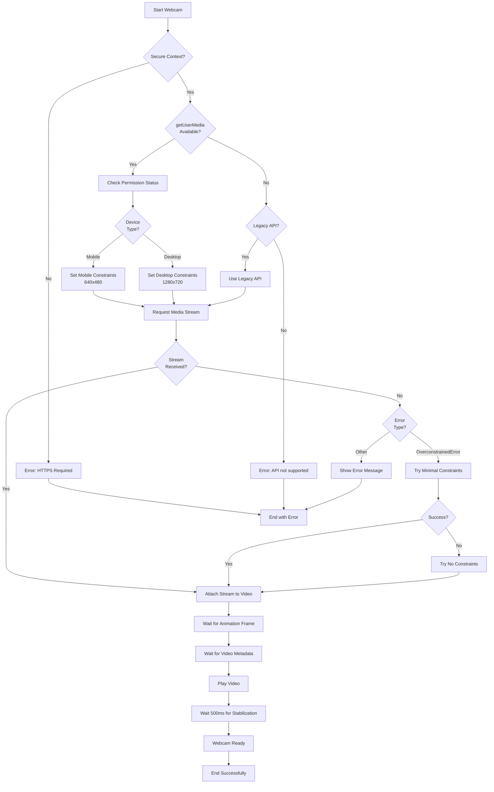
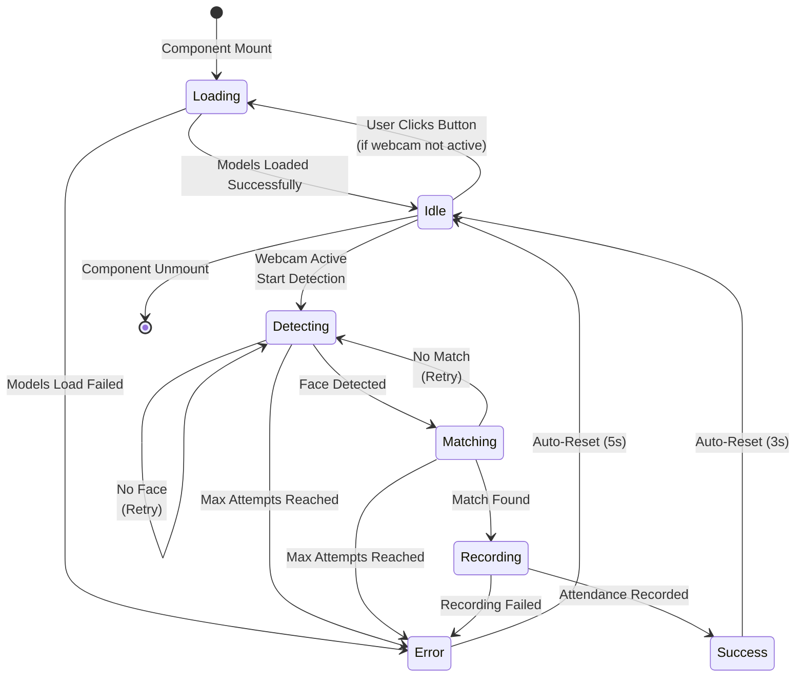
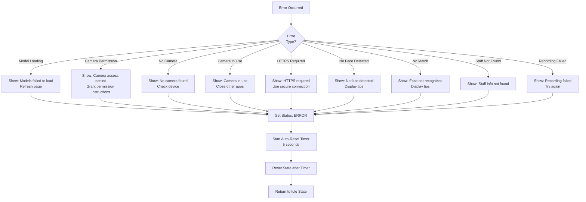
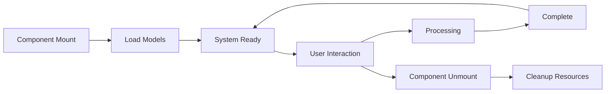

# AttendanceTerminal Component Flowchart

This document contains the flowchart visualization of the AttendanceTerminal component logic flow.

## Plain Text Flowcharts

The following sections contain plain text flowcharts that can be viewed in any text editor.

---

## MAIN FLOWCHART (Plain Text)

```
┌─────────────────────────────────────┐
│     COMPONENT MOUNT                 │
└──────────────┬──────────────────────┘
               │
               ▼
┌─────────────────────────────────────┐
│  Load Face Recognition Models       │
│  Status: LOADING                    │
└──────────────┬──────────────────────┘
               │
               ▼
        ┌──────┴──────┐
        │             │
        ▼             ▼
   ┌─────────┐  ┌─────────────┐
   │ SUCCESS │  │    ERROR    │
   └────┬────┘  └──────┬──────┘
        │              │
        │              └──► Display Error
        │                    Stay in ERROR state
        │
        ▼
┌─────────────────────────────────────┐
│  Status: IDLE                       │
│  System Ready                       │
│  Waiting for User Input             │
└──────────────┬──────────────────────┘
               │
               ▼
        ┌──────┴──────┐
        │             │
        ▼             ▼
┌──────────────┐  ┌──────────────┐
│ Click Time In│  │Click Time Out│
└──────┬───────┘  └──────┬───────┘
       │                 │
       └────────┬────────┘
                │
                ▼
┌─────────────────────────────────────┐
│  processAttendance(type)            │
│  Check: Are models loaded?          │
└──────────────┬──────────────────────┘
               │
        ┌──────┴──────┐
        │             │
        ▼             ▼
   ┌─────────┐  ┌─────────────┐
   │   NO    │  │    YES      │
   └────┬────┘  └──────┬──────┘
        │              │
        │              ▼
        │      ┌──────────────────────┐
        │      │ Set isProcessing=true│
        │      │ Set actionType       │
        │      │ Clear errors         │
        │      └──────────┬───────────┘
        │                 │
        │                 ▼
        │          ┌──────┴──────┐
        │          │             │
        │          ▼             ▼
        │     ┌─────────┐  ┌──────────────┐
        │     │   NO    │  │     YES      │
        │     └────┬────┘  └──────┬───────┘
        │          │              │
        │          │              └──► Start Face Detection
        │          │                    Overlay
        │          │
        │          ▼
        │  ┌──────────────────────┐
        │  │  START WEBCAM        │
        │  └──────────┬───────────┘
        │             │
        └──► Error:   │
     Models not       │
        loaded        │
                      ▼
              ┌───────────────┐
              │ Check HTTPS   │
              │ or Localhost? │
              └───────┬───────┘
                      │
              ┌───────┴───────┐
              │               │
              ▼               ▼
         ┌─────────┐    ┌─────────┐
         │   NO    │    │   YES   │
         └────┬────┘    └────┬────┘
              │              │
              │              ▼
              │      ┌─────────────────┐
              │      │ Check getUserMedia│
              │      │ Available?       │
              │      └──────┬───────────┘
              │             │
              │      ┌──────┴──────┐
              │      │             │
              │      ▼             ▼
              │  ┌─────────┐  ┌─────────────┐
              │  │   NO    │  │    YES      │
              │  └────┬────┘  └──────┬──────┘
              │       │              │
              │       │              ▼
              │       │      ┌─────────────────┐
              │       │      │ Check Permission│
              │       │      └────────┬────────┘
              │       │               │
              │       │               ▼
              │       │      ┌─────────────────┐
              │       │      │ Request Camera  │
              │       │      │ with Constraints│
              │       │      └────────┬────────┘
              │       │               │
              │       │               ▼
              │       │      ┌─────────────────┐
              │       │      │ Constraint Error?│
              │       │      └──────┬───────────┘
              │       │             │
              │       │      ┌──────┴──────┐
              │       │      │             │
              │       │      ▼             ▼
              │       │  ┌─────────┐  ┌─────────┐
              │       │  │   YES   │  │   NO    │
              │       │  └────┬────┘  └────┬────┘
              │       │       │            │
              │       │       │            └──► Video Ready
              │       │       │
              │       │       ▼
              │       │  ┌─────────────────┐
              │       │  │ Try Minimal     │
              │       │  │ Constraints     │
              │       │  └────────┬────────┘
              │       │           │
              │       │     ┌─────┴─────┐
              │       │     │           │
              │       │     ▼           ▼
              │       │ ┌─────────┐ ┌─────────┐
              │       │ │  ERROR  │ │ SUCCESS │
              │       │ └────┬────┘ └────┬────┘
              │       │      │           │
              │       │      │           └──► Video Ready
              │       │      │
              │       │      ▼
              │       │ ┌─────────────────┐
              │       │ │ Try No          │
              │       │ │ Constraints     │
              │       │ └────────┬────────┘
              │       │          │
              │       │          └──► Video Ready
              │       │
              │       ▼
              │  ┌─────────────────┐
              │  │ Check Legacy API│
              │  └──────┬──────────┘
              │         │
              │    ┌────┴────┐
              │    │         │
              │    ▼         ▼
              │ ┌──────┐ ┌──────────┐
              │ │  NO  │ │   YES    │
              │ └──┬───┘ └────┬─────┘
              │    │          │
              │    │          └──► Use Legacy API
              │    │                Video Ready
              │    │
              │    ▼
              │ Error: Browser not supported
              │
              ▼
        Error: HTTPS Required
              │
              └──► Display Error
                   Auto-reset after 5s

Video Ready
      │
      ▼
┌─────────────────────────────────────┐
│  Wait 1.5s for Stabilization        │
└──────────────┬──────────────────────┘
               │
               ▼
        ┌──────┴──────┐
        │             │
        ▼             ▼
   ┌─────────┐  ┌─────────┐
   │   NO    │  │   YES   │
   └────┬────┘  └────┬────┘
        │            │
        │            └──► Start Face Detection
        │                  Overlay
        │
        ▼
   Error: Camera failed
   Display Error
   Auto-reset after 5s

Start Face Detection Overlay
      │
      ▼
┌─────────────────────────────────────┐
│  DETECTION LOOP                     │
│  Max 12 Attempts                    │
│  Initialize:                        │
│  - bestMatch = null                 │
│  - faceDescriptor = null            │
│  - lastFailureReason = null         │
└──────────────┬──────────────────────┘
               │
               ▼
┌─────────────────────────────────────┐
│  FOR attempt = 1 to 12              │
│  Set currentAttempt = attempt       │
│  Status: DETECTING                  │
└──────────────┬──────────────────────┘
               │
               ▼
┌─────────────────────────────────────┐
│  Detect Face from Video             │
└──────────────┬──────────────────────┘
               │
               ▼
        ┌──────┴──────┐
        │             │
        ▼             ▼
   ┌─────────┐  ┌─────────┐
   │   NO    │  │   YES   │
   └────┬────┘  └────┬────┘
        │            │
        │            └──► Status: MATCHING
        │                  Match with Database
        │                  Threshold: 0.6
        │
        ▼
   Set lastFailureReason = 'no-face'
        │
        ▼
   Wait 400ms
        │
        ▼
   ┌──────┴──────┐
   │             │
   ▼             ▼
┌───────┐    ┌──────────┐
│  < 12 │    │   = 12   │
└───┬───┘    └────┬─────┘
    │             │
    │             └──► Max Attempts Reached
    │                   Error: No face detected
    │                   Show tips
    │                   Auto-reset after 5s
    │
    └──► Loop back to Detection

Status: MATCHING
      │
      ▼
┌─────────────────────────────────────┐
│  Find Matching Staff                │
│  Threshold: 0.6                     │
└──────────────┬──────────────────────┘
               │
               ▼
        ┌──────┴──────┐
        │             │
        ▼             ▼
   ┌─────────┐  ┌─────────┐
   │   NO    │  │   YES   │
   └────┬────┘  └────┬────┘
        │            │
        │            └──► Get Staff Information
        │                  from Database
        │
        ▼
   Set lastFailureReason = 'no-match'
        │
        ▼
   Wait 400ms
        │
        ▼
   ┌──────┴──────┐
   │             │
   ▼             ▼
┌───────┐    ┌──────────┐
│  < 12 │    │   = 12   │
└───┬───┘    └────┬─────┘
    │             │
    │             └──► Max Attempts Reached
    │                   Error: Face not recognized
    │                   Show tips
    │                   Auto-reset after 5s
    │
    └──► Loop back to Detection

Get Staff Information
      │
      ▼
┌─────────────────────────────────────┐
│  Fetch Staff Info from Database     │
└──────────────┬──────────────────────┘
               │
               ▼
        ┌──────┴──────┐
        │             │
        ▼             ▼
   ┌─────────┐  ┌─────────┐
   │   NO    │  │   YES   │
   └────┬────┘  └────┬────┘
        │            │
        │            └──► Set Detection Result
        │                  with Confidence
        │
        ▼
   Error: Staff not found
   Display Error
   Auto-reset after 5s

Set Detection Result
      │
      ▼
┌─────────────────────────────────────┐
│  Status: RECORDING                  │
│  Record Attendance                  │
└──────────────┬──────────────────────┘
               │
               ▼
        ┌──────┴──────┐
        │             │
        ▼             ▼
┌──────────────┐  ┌──────────────┐
│ Record Time In│  │Record Time Out│
└──────┬───────┘  └──────┬───────┘
       │                 │
       └────────┬────────┘
                │
                ▼
┌─────────────────────────────────────┐
│  Format Time String                 │
│  Create Success Message             │
└──────────────┬──────────────────────┘
               │
               ▼
┌─────────────────────────────────────┐
│  Status: SUCCESS                    │
│  Display Success Message            │
│  Show Staff Info                    │
│  Show Confidence                    │
└──────────────┬──────────────────────┘
               │
               ▼
┌─────────────────────────────────────┐
│  Auto-Reset Timer: 3 seconds        │
└──────────────┬──────────────────────┘
               │
               ▼
┌─────────────────────────────────────┐
│  Reset State                        │
│  - Set isProcessing = false         │
│  - Set actionType = null            │
│  - Set status = 'idle'              │
│  - Clear detectionResult            │
│  - Clear error                      │
│  - Stop webcam                      │
│  - Clear timers                     │
└──────────────┬──────────────────────┘
               │
               ▼
        Return to IDLE State
```

---

## WEBCAM INITIALIZATION FLOW (Plain Text)

```
┌─────────────────────────────────────┐
│     START WEBCAM                    │
└──────────────┬──────────────────────┘
               │
               ▼
        ┌──────┴──────┐
        │             │
        ▼             ▼
   ┌─────────┐  ┌─────────┐
   │   NO    │  │   YES   │
   └────┬────┘  └────┬────┘
        │            │
        │            └──► Check Permission Status
        │
        ▼
   Error: HTTPS Required
   (Camera requires secure context)

Check Permission Status
      │
      ▼
┌─────────────────────────────────────┐
│  Detect Device Type                 │
└──────────────┬──────────────────────┘
               │
               ▼
        ┌──────┴──────┐
        │             │
        ▼             ▼
┌──────────────┐  ┌──────────────┐
│    MOBILE    │  │   DESKTOP    │
│ 640x480      │  │ 1280x720     │
└──────┬───────┘  └──────┬───────┘
       │                 │
       └────────┬────────┘
                │
                ▼
┌─────────────────────────────────────┐
│  Request Media Stream               │
│  with Constraints                   │
└──────────────┬──────────────────────┘
               │
               ▼
        ┌──────┴──────┐
        │             │
        ▼             ▼
   ┌─────────┐  ┌─────────┐
   │ SUCCESS │  │  ERROR  │
   └────┬────┘  └────┬────┘
        │            │
        │            └──► Check Error Type
        │
        ▼
   Attach Stream to Video
        │
        ▼
   Wait for Animation Frame
        │
        ▼
   Wait for Video Metadata
        │
        ▼
   Play Video
        │
        ▼
   Wait 500ms for Stabilization
        │
        ▼
   WEBCAM READY

Check Error Type
      │
      ▼
┌─────────────────────────────────────┐
│  Error Type?                        │
│  - OverconstrainedError             │
│  - NotAllowedError                  │
│  - NotFoundError                    │
│  - NotReadableError                 │
│  - Other                            │
└──────────────┬──────────────────────┘
               │
               ▼
        ┌──────┴──────┐
        │             │
        ▼             ▼
┌──────────────┐  ┌──────────────┐
│Overconstrained│  │    Other     │
└──────┬───────┘  └──────┬───────┘
       │                 │
       │                 └──► Show Error Message
       │                      Display guidance
       │                      Auto-reset after 5s
       │
       ▼
┌─────────────────────────────────────┐
│  Try Minimal Constraints            │
│  (facingMode: 'user' only)          │
└──────────────┬──────────────────────┘
               │
               ▼
        ┌──────┴──────┐
        │             │
        ▼             ▼
   ┌─────────┐  ┌─────────┐
   │ SUCCESS │  │  ERROR  │
   └────┬────┘  └────┬────┘
        │            │
        │            └──► Try No Constraints
        │                  (video: true)
        │
        └──► Attach Stream
             Continue to Ready
```

---

## FACE DETECTION LOOP (Plain Text)

```
┌─────────────────────────────────────┐
│  START DETECTION LOOP               │
│  Initialize Variables:              │
│  - bestMatch = null                 │
│  - faceDescriptor = null            │
│  - lastFailureReason = null         │
└──────────────┬──────────────────────┘
               │
               ▼
┌─────────────────────────────────────┐
│  FOR attempt = 1 to MAX_ATTEMPTS(12)│
└──────────────┬──────────────────────┘
               │
               ▼
┌─────────────────────────────────────┐
│  Set currentAttempt = attempt       │
│  Status: DETECTING                  │
│  Update Status Message              │
└──────────────┬──────────────────────┘
               │
               ▼
┌─────────────────────────────────────┐
│  Try Detect Face from Video         │
│  faceRegistrationService.detectFace │
└──────────────┬──────────────────────┘
               │
               ▼
        ┌──────┴──────┐
        │             │
        ▼             ▼
   ┌─────────┐  ┌─────────┐
   │   NO    │  │   YES   │
   │  ERROR  │  │ SUCCESS │
   └────┬────┘  └────┬────┘
        │            │
        │            └──► Status: MATCHING
        │                  Match with Database
        │
        ▼
   Set lastFailureReason = 'no-face'
   Set faceDescriptor = null
        │
        ▼
   Wait 400ms (DETECTION_DELAY_MS)
        │
        ▼
   ┌──────┴──────┐
   │             │
   ▼             ▼
┌───────┐    ┌──────────┐
│  < 12 │    │   = 12   │
└───┬───┘    └────┬─────┘
    │             │
    │             └──► EXIT: No Face Detected
    │                   Return Failure
    │                   Show NO_FACE_TIPS
    │
    └──► Continue Loop (next attempt)

Status: MATCHING
      │
      ▼
┌─────────────────────────────────────┐
│  Find Matching Staff                │
│  faceRegistrationService            │
│  .findMatchingStaff(descriptor, 0.6)│
└──────────────┬──────────────────────┘
               │
               ▼
        ┌──────┴──────┐
        │             │
        ▼             ▼
   ┌─────────┐  ┌─────────┐
   │   NO    │  │   YES   │
   └────┬────┘  └────┬────┘
        │            │
        │            └──► Set bestMatch = matches[0]
        │                  EXIT: Match Found
        │                  Return Success
        │
        ▼
   Set lastFailureReason = 'no-match'
        │
        ▼
   Wait 400ms (DETECTION_DELAY_MS)
        │
        ▼
   ┌──────┴──────┐
   │             │
   ▼             ▼
┌───────┐    ┌──────────┐
│  < 12 │    │   = 12   │
└───┬───┘    └────┬─────┘
    │             │
    │             └──► EXIT: No Match Found
    │                   Return Failure
    │                   Show NO_MATCH_TIPS
    │
    └──► Continue Loop (next attempt)
```

---

## STATE TRANSITIONS (Plain Text)

```
COMPONENT LIFECYCLE STATES:

[INITIAL]
    │
    ▼
[LOADING] ────────┐
    │             │
    │             │ (on error)
    │             │
    ▼             ▼
[IDLE]      [ERROR] ───► Auto-reset (5s) ──► [IDLE]
    │
    │ (user clicks button)
    │
    ▼
[DETECTING] ──────┐
    │             │
    │             │ (no face, retry)
    │             │
    │             │ (max attempts)
    │             │
    ▼             ▼
[MATCHING]   [ERROR] ───► Auto-reset (5s) ──► [IDLE]
    │
    │ (no match, retry)
    │
    │ (match found)
    │
    ▼
[RECORDING]
    │
    │ (success)
    │ (error)
    │
    ▼         ▼
[SUCCESS] [ERROR]
    │         │
    │         │ Auto-reset (5s)
    │         │
    │ Auto-reset (3s)
    │
    ▼
[IDLE]

STATUS FLOW SUMMARY:
- LOADING → IDLE (on success) or ERROR (on failure)
- IDLE → DETECTING (on user action)
- DETECTING → MATCHING (face found) or ERROR (max attempts)
- MATCHING → RECORDING (match found) or DETECTING (retry) or ERROR (max attempts)
- RECORDING → SUCCESS (recorded) or ERROR (failed)
- SUCCESS → IDLE (after 3s auto-reset)
- ERROR → IDLE (after 5s auto-reset)
```

---

## ERROR HANDLING FLOW (Plain Text)

```
ERROR OCCURRED
      │
      ▼
┌─────────────────────────────────────┐
│  Identify Error Type                │
└──────────────┬──────────────────────┘
               │
               ▼
    ┌──────────┼──────────┬──────────┬──────────┬──────────┬──────────┬──────────┬──────────┐
    │          │          │          │          │          │          │          │          │
    ▼          ▼          ▼          ▼          ▼          ▼          ▼          ▼          ▼
┌─────────┐ ┌─────────┐ ┌─────────┐ ┌─────────┐ ┌─────────┐ ┌─────────┐ ┌─────────┐ ┌─────────┐
│  Model  │ │ Camera  │ │   No    │ │ Camera  │ │  HTTPS  │ │   No    │ │   No    │ │  Staff  │
│ Loading │ │Permission│ │ Camera  │ │ In Use  │ │Required │ │  Face   │ │  Match  │ │  Not    │
│ Failed  │ │ Denied   │ │ Found   │ │         │ │         │ │Detected │ │  Found  │ │  Found  │
└────┬────┘ └────┬────┘ └────┬────┘ └────┬────┘ └────┬────┘ └────┬────┘ └────┬────┘ └────┬────┘
     │           │           │           │           │           │           │           │
     │           │           │           │           │           │           │           │
     └───────────┴───────────┴───────────┴───────────┴───────────┴───────────┴───────────┴─────────┐
                                       │
                                       ▼
                            ┌──────────────────────┐
                            │  Set Status: ERROR   │
                            │  Set Error Message   │
                            │  Display Guidance    │
                            └──────────┬───────────┘
                                       │
                                       ▼
                            ┌──────────────────────┐
                            │  Start Auto-Reset    │
                            │  Timer: 5 seconds    │
                            └──────────┬───────────┘
                                       │
                                       ▼
                            ┌──────────────────────┐
                            │  Reset State         │
                            │  - Clear error       │
                            │  - Stop webcam       │
                            │  - Clear timers      │
                            │  - Set status: IDLE  │
                            └──────────┬───────────┘
                                       │
                                       ▼
                            ┌──────────────────────┐
                            │  Return to IDLE      │
                            │  State               │
                            └──────────────────────┘

ERROR MESSAGES BY TYPE:

1. Model Loading Failed:
   "Failed to load face recognition models. Please refresh the page."

2. Camera Permission Denied:
   "Camera access was denied. Please allow camera access in browser settings."

3. No Camera Found:
   "No camera found. Please ensure a camera is connected."

4. Camera In Use:
   "Camera is not accessible. The camera may be in use by another application."

5. HTTPS Required:
   "Camera access requires HTTPS. Please access this page over HTTPS or use localhost."

6. No Face Detected:
   "No face detected after 12 attempts. Please try again."
   + Display NO_FACE_TIPS

7. No Match Found:
   "Face not recognized after 12 attempts. Please try again."
   + Display NO_MATCH_TIPS

8. Staff Not Found:
   "Staff information not found in database."

9. Recording Failed:
   "Failed to process attendance. Please try again."
```

---

## COMPONENT LIFECYCLE (Plain Text)

```
┌─────────────────┐
│  COMPONENT      │
│  MOUNT          │
└────────┬────────┘
         │
         ▼
┌─────────────────┐
│  Load Models    │
│  (useEffect)    │
└────────┬────────┘
         │
         ▼
┌─────────────────┐
│  SYSTEM READY   │
│  Status: IDLE   │
└────────┬────────┘
         │
         │
         ▼
┌─────────────────┐
│  USER           │
│  INTERACTION    │
│  (Time In/Out)  │
└────────┬────────┘
         │
         ▼
┌─────────────────┐
│  PROCESSING     │
│  - Camera       │
│  - Detection    │
│  - Matching     │
│  - Recording    │
└────────┬────────┘
         │
         ▼
┌─────────────────┐
│  COMPLETE       │
│  - Success      │
│  - Error        │
└────────┬────────┘
         │
         │ (auto-reset)
         │
         ▼
┌─────────────────┐
│  SYSTEM READY   │
│  (loop back)    │
└─────────────────┘
         │
         │ (component unmount)
         │
         ▼
┌─────────────────┐
│  CLEANUP        │
│  - Stop webcam  │
│  - Clear        │
│    intervals    │
│  - Clear        │
│    timeouts     │
└─────────────────┘
```

---

## KEY CONSTANTS AND THRESHOLDS

- MAX_DETECTION_ATTEMPTS: 12
- DETECTION_DELAY_MS: 400ms
- SUCCESS_DISPLAY_DURATION_MS: 3000ms (3 seconds)
- ERROR_DISPLAY_DURATION_MS: 5000ms (5 seconds)
- FACE_MATCH_THRESHOLD: 0.6
- WEBCAM_STABILIZATION_DELAY: 1500ms (1.5 seconds)
- VIDEO_INITIALIZATION_DELAY: 500ms

---

## Main Flowchart (Mermaid - Original)

```mermaid
flowchart TD
    Start([Component Mount]) --> LoadModels[Load Face Recognition Models]
    LoadModels --> ModelsLoaded{Models<br/>Loaded?}
    ModelsLoaded -->|Success| IdleState[Status: IDLE<br/>Ready for Input]
    ModelsLoaded -->|Error| ErrorState1[Status: ERROR<br/>Display Error Message]
    
    IdleState --> UserAction{User Clicks<br/>Button}
    UserAction -->|Time In| ProcessTimeIn[processAttendance 'timein']
    UserAction -->|Time Out| ProcessTimeOut[processAttendance 'timeout']
    
    ProcessTimeIn --> CheckModels{Models<br/>Loaded?}
    ProcessTimeOut --> CheckModels
    
    CheckModels -->|No| ErrorModels[Error: Models not loaded]
    CheckModels -->|Yes| SetProcessing[Set isProcessing = true<br/>Set actionType<br/>Clear errors]
    
    SetProcessing --> CheckWebcam{Webcam<br/>Active?}
    
    CheckWebcam -->|No| StartWebcam[Start Webcam Process]
    CheckWebcam -->|Yes| StartDetection[Start Face Detection Overlay]
    
    StartWebcam --> CheckHTTPS{HTTPS or<br/>Localhost?}
    CheckHTTPS -->|No| ErrorHTTPS[Error: HTTPS Required]
    CheckHTTPS -->|Yes| CheckGetUserMedia{getUserMedia<br/>Available?}
    
    CheckGetUserMedia -->|No| CheckLegacy{Legacy API<br/>Available?}
    CheckGetUserMedia -->|Yes| CheckPermission[Check Camera Permission]
    CheckLegacy -->|No| ErrorBrowser[Error: Browser not supported]
    CheckLegacy -->|Yes| UseLegacy[Use Legacy getUserMedia API]
    
    CheckPermission --> RequestCamera[Request Camera Access<br/>with Optimized Constraints]
    RequestCamera --> ConstraintError{Constraint<br/>Error?}
    ConstraintError -->|Yes| TryMinimal[Try Minimal Constraints]
    TryMinimal --> MinimalError{Error?}
    MinimalError -->|Yes| TryNoConstraints[Try No Constraints]
    MinimalError -->|No| VideoReady[Video Stream Ready]
    TryNoConstraints --> VideoReady
    ConstraintError -->|No| VideoReady
    UseLegacy --> VideoReady
    
    VideoReady --> WaitStabilize[Wait 1.5s for Stabilization]
    WaitStabilize --> VerifyCamera{Camera<br/>Working?}
    VerifyCamera -->|No| ErrorCamera[Error: Camera failed to start]
    VerifyCamera -->|Yes| StartDetection
    
    StartDetection --> DetectionLoop[Detection Loop<br/>Max 12 Attempts]
    
    DetectionLoop --> Attempt[Attempt N of 12<br/>Status: DETECTING]
    Attempt --> DetectFace[Detect Face from Video]
    DetectFace --> FaceDetected{Face<br/>Detected?}
    
    FaceDetected -->|No| SetNoFace[Set lastFailureReason = 'no-face']
    SetNoFace --> Delay1[Wait 400ms]
    Delay1 --> CheckAttempts1{Attempts<br/>< 12?}
    CheckAttempts1 -->|Yes| Attempt
    CheckAttempts1 -->|No| MaxAttemptsReached[Max Attempts Reached]
    
    FaceDetected -->|Yes| StatusMatching[Status: MATCHING<br/>Match with Database]
    StatusMatching --> MatchFace[Find Matching Staff<br/>Threshold: 0.6]
    MatchFace --> MatchFound{Match<br/>Found?}
    
    MatchFound -->|No| SetNoMatch[Set lastFailureReason = 'no-match']
    SetNoMatch --> Delay2[Wait 400ms]
    Delay2 --> CheckAttempts2{Attempts<br/>< 12?}
    CheckAttempts2 -->|Yes| Attempt
    CheckAttempts2 -->|No| MaxAttemptsReached
    
    MatchFound -->|Yes| GetStaffInfo[Get Staff Information<br/>from Database]
    GetStaffInfo --> StaffFound{Staff<br/>Found?}
    StaffFound -->|No| ErrorStaff[Error: Staff not found]
    StaffFound -->|Yes| SetDetectionResult[Set Detection Result<br/>with Confidence]
    
    SetDetectionResult --> StatusRecording[Status: RECORDING<br/>Record Attendance]
    StatusRecording --> RecordType{Action<br/>Type?}
    RecordType -->|timein| RecordTimeIn[Record Time In]
    RecordType -->|timeout| RecordTimeOut[Record Time Out]
    
    RecordTimeIn --> FormatTime[Format Time String]
    RecordTimeOut --> FormatTime
    FormatTime --> StatusSuccess[Status: SUCCESS<br/>Display Success Message]
    
    StatusSuccess --> AutoResetSuccess[Auto-Reset Timer<br/>3 seconds]
    AutoResetSuccess --> ResetState[Reset State<br/>Stop Webcam<br/>Clear Timers]
    ResetState --> IdleState
    
    MaxAttemptsReached --> ErrorDetection[Error: Detection Failed<br/>Show Tips]
    ErrorDetection --> AutoResetError[Auto-Reset Timer<br/>5 seconds]
    AutoResetError --> ResetState
    
    ErrorModels --> ErrorState2[Status: ERROR]
    ErrorHTTPS --> ErrorState2
    ErrorBrowser --> ErrorState2
    ErrorCamera --> ErrorState2
    ErrorStaff --> ErrorState2
    ErrorState2 --> AutoResetError
    
    ErrorState1 --> End1([Component Unmount])
    End1 --> Cleanup[Cleanup:<br/>Stop Webcam<br/>Clear Intervals<br/>Clear Timeouts]
    
    style Start fill:#e1f5ff
    style IdleState fill:#90EE90
    style StatusSuccess fill:#90EE90
    style ErrorState1 fill:#ffcccc
    style ErrorState2 fill:#ffcccc
    style ErrorDetection fill:#ffcccc
    style DetectionLoop fill:#fff4e6
    style StatusMatching fill:#fff4e6
    style StatusRecording fill:#fff4e6
```



## Sub-process: Webcam Initialization Flow



## Sub-process: Face Detection Loop

```mermaid
flowchart TD
    StartLoop[Start Detection Loop] --> InitVars[Initialize Variables:<br/>bestMatch = null<br/>faceDescriptor = null<br/>lastFailureReason = null]
    
    InitVars --> LoopStart[For attempt = 1 to 12]
    LoopStart --> SetAttempt[Set currentAttempt = attempt<br/>Status: DETECTING]
    
    SetAttempt --> TryDetect[Try Detect Face]
    TryDetect --> DetectSuccess{Face<br/>Detected?}
    
    DetectSuccess -->|Error| SetNoFace[Set lastFailureReason = 'no-face'<br/>faceDescriptor = null]
    DetectSuccess -->|No Face| SetNoFace
    DetectSuccess -->|Success| SetMatching[Status: MATCHING<br/>Match with Database]
    
    SetNoFace --> DelayNoFace[Wait 400ms]
    DelayNoFace --> CheckMax1{Attempt<br/>< 12?}
    CheckMax1 -->|Yes| LoopStart
    CheckMax1 -->|No| ExitNoFace[Exit: No Face Detected]
    
    SetMatching --> FindMatch[Find Matching Staff<br/>Threshold: 0.6]
    FindMatch --> MatchResult{Match<br/>Found?}
    
    MatchResult -->|No| SetNoMatch[Set lastFailureReason = 'no-match']
    SetNoMatch --> DelayNoMatch[Wait 400ms]
    DelayNoMatch --> CheckMax2{Attempt<br/>< 12?}
    CheckMax2 -->|Yes| LoopStart
    CheckMax2 -->|No| ExitNoMatch[Exit: No Match Found]
    
    MatchResult -->|Yes| SetBestMatch[Set bestMatch = matches[0]]
    SetBestMatch --> ExitSuccess[Exit: Match Found]
    
    ExitNoFace --> ReturnFailure[Return Failure]
    ExitNoMatch --> ReturnFailure
    ExitSuccess --> ReturnSuccess[Return Success]
```

## State Transitions



## Key Constants and Thresholds

- **MAX_DETECTION_ATTEMPTS**: 12
- **DETECTION_DELAY_MS**: 400ms
- **SUCCESS_DISPLAY_DURATION_MS**: 3000ms (3 seconds)
- **ERROR_DISPLAY_DURATION_MS**: 5000ms (5 seconds)
- **FACE_MATCH_THRESHOLD**: 0.6
- **WEBCAM_STABILIZATION_DELAY**: 1500ms (1.5 seconds)
- **VIDEO_INITIALIZATION_DELAY**: 500ms

## Error Handling Flow



## Component Lifecycle



This flowchart provides a comprehensive visualization of the AttendanceTerminal component's logic flow, including all major processes, error handling, and state transitions.

