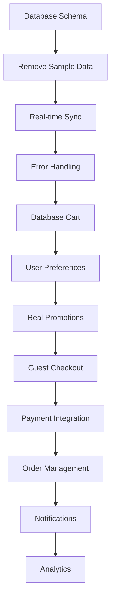

# 🚀 PWA Implementation Roadmap & Strategy

Based on the analysis of your PWA codebase, here's a comprehensive implementation plan that prioritizes core functionality while building toward a complete system.

## 📋 **Implementation Priority Matrix**

### **Phase 1: Foundation & Core Features (MVP)**
*Priority: CRITICAL - Build these first*

### **Phase 2: Enhanced User Experience**
*Priority: HIGH - Build after Phase 1*

### **Phase 3: Advanced Features**
*Priority: MEDIUM - Build after Phase 2*

### **Phase 4: Optimization & Scale**
*Priority: LOW - Build after Phase 3*

---

## 🎯 **Phase 1: Foundation & Core Features (MVP)**

### **1.1 Database Schema Validation & Setup**
**Priority: CRITICAL | Dependencies: None | Timeline: 1-2 days**

```sql
-- Verify all required tables exist
- branches ✅
- products ✅
- product_variants ✅
- categories ✅
- inventory ✅
- customers ✅
- orders ✅
- order_items ✅
- promotions ✅
```

**Why First:** Everything depends on a solid database foundation.

**Tasks:**
- [ ] Verify all tables exist in Supabase
- [ ] Check table relationships and foreign keys
- [ ] Validate data types match TypeScript interfaces
- [ ] Test database connectivity
- [ ] Set up proper indexes for performance

### **1.2 Remove Sample Data Fallbacks**
**Priority: CRITICAL | Dependencies: 1.1 | Timeline: 2-3 days**

**Files to Update:**
- `ProductCatalog.tsx` - Remove `sampleProducts` fallback
- `BranchSelection.tsx` - Remove `sampleBranches` fallback
- `FilterSidebar.tsx` - Remove `sampleCategories` fallback

**Implementation:**
```typescript
// Before: Fallback to sample data
catch (err) {
  setProducts(sampleProducts) // ❌ Remove this
}

// After: Proper error handling
catch (err) {
  setError('Failed to load products. Please try again.')
  setProducts([]) // ✅ Empty state
}
```

**Why Second:** Sample data masks real issues and creates false confidence.

**Tasks:**
- [ ] Remove all `sampleProducts` references
- [ ] Remove all `sampleBranches` references
- [ ] Remove all `sampleCategories` references
- [ ] Implement proper error states
- [ ] Add retry mechanisms
- [ ] Test error scenarios

### **1.3 Real-time Data Synchronization**
**Priority: CRITICAL | Dependencies: 1.2 | Timeline: 3-4 days**

**Features:**
- Real-time inventory updates
- Live branch status changes
- Product availability sync

**Implementation:**
```typescript
// Add to BranchContext.tsx
useEffect(() => {
  const subscription = supabase
    .channel('branches')
    .on('postgres_changes', 
      { event: 'UPDATE', schema: 'public', table: 'branches' },
      (payload) => {
        // Update branch data in real-time
        updateBranchInCache(payload.new)
      }
    )
    .subscribe()
}, [])
```

**Why Third:** Users need live data for accurate decision-making.

**Tasks:**
- [ ] Set up Supabase real-time subscriptions
- [ ] Implement inventory updates
- [ ] Add branch status updates
- [ ] Handle connection/disconnection
- [ ] Test real-time functionality
- [ ] Add offline/online indicators

### **1.4 Robust Error Handling & Loading States**
**Priority: CRITICAL | Dependencies: 1.2 | Timeline: 2-3 days**

**Features:**
- Network error recovery
- Retry mechanisms
- Offline indicators
- Graceful degradation

**Why Fourth:** Essential for production reliability.

**Tasks:**
- [ ] Implement global error boundary
- [ ] Add network status detection
- [ ] Create retry mechanisms
- [ ] Add loading skeletons
- [ ] Implement offline mode
- [ ] Add error logging

---

## 🎯 **Phase 2: Enhanced User Experience**

### **2.1 Database-Backed Cart System**
**Priority: HIGH | Dependencies: 1.3 | Timeline: 4-5 days**

**Current Issue:** Cart is pure localStorage
**Solution:** Hybrid approach with database persistence

**Implementation Strategy:**
```typescript
// New CartService
class CartService {
  async saveCartToDatabase(cart: Cart, userId?: string) {
    // Save to database for persistence
  }
  
  async loadCartFromDatabase(userId?: string) {
    // Load from database on app start
  }
  
  async syncCartWithDatabase(cart: Cart) {
    // Sync localStorage with database
  }
}
```

**Why First in Phase 2:** Cart is core to the shopping experience.

**Tasks:**
- [ ] Create `CartService` class
- [ ] Add cart persistence to database
- [ ] Implement cart sync logic
- [ ] Handle guest vs authenticated users
- [ ] Add cart conflict resolution
- [ ] Test cart persistence

### **2.2 User Preferences & Settings Backend**
**Priority: HIGH | Dependencies: 1.3 | Timeline: 3-4 days**

**Features:**
- Save user preferences to database
- Real-time preference sync
- Cross-device preference sharing

**Implementation:**
```typescript
// Add to UserSettings.tsx
const saveSettings = async (section: string) => {
  // Save to database instead of just localStorage
  await supabase
    .from('user_preferences')
    .upsert({
      customer_id: user.id,
      ...settings,
      updated_at: new Date().toISOString()
    })
}
```

**Why Second:** Improves user experience and data persistence.

**Tasks:**
- [ ] Create `user_preferences` table
- [ ] Update UserSettings component
- [ ] Add preference sync logic
- [ ] Handle preference conflicts
- [ ] Test cross-device sync
- [ ] Add preference validation

### **2.3 Real Promotional System**
**Priority: HIGH | Dependencies: 1.3 | Timeline: 3-4 days**

**Current Issue:** Uses sample data
**Solution:** Connect to real promotions table

**Implementation:**
```typescript
// Update PromotionService
class PromotionService {
  async getActivePromotions(): Promise<Promotion[]> {
    const { data, error } = await supabase
      .from('promotions')
      .select('*')
      .eq('is_active', true)
      .gte('valid_until', new Date().toISOString())
    
    return this.mapPromotions(data || [])
  }
}
```

**Why Third:** Marketing features drive engagement.

**Tasks:**
- [ ] Update PromotionService
- [ ] Remove sample promotional data
- [ ] Add promotion validation
- [ ] Implement promotion targeting
- [ ] Add promotion analytics
- [ ] Test promotion display logic

---

## 🎯 **Phase 3: Advanced Features**

### **3.1 Guest Checkout System**
**Priority: MEDIUM | Dependencies: 2.1 | Timeline: 5-6 days**

**Features:**
- OTP verification
- Guest order tracking
- Guest-to-customer conversion

**Implementation Strategy:**
```typescript
// New GuestCheckoutService
class GuestCheckoutService {
  async createGuestOrder(orderData: GuestOrderData) {
    // Create order without user account
  }
  
  async sendOTP(phone: string) {
    // Send OTP for verification
  }
  
  async verifyOTP(phone: string, code: string) {
    // Verify OTP
  }
}
```

**Why First in Phase 3:** Removes friction for new users.

**Tasks:**
- [ ] Create guest order flow
- [ ] Implement OTP system
- [ ] Add guest order tracking
- [ ] Create guest-to-customer conversion
- [ ] Add guest data validation
- [ ] Test guest checkout flow

### **3.2 Payment Integration**
**Priority: MEDIUM | Dependencies: 3.1 | Timeline: 6-8 days**

**Features:**
- GCash integration
- PayMaya integration
- Payment status tracking

**Implementation:**
```typescript
// New PaymentService
class PaymentService {
  async processGCashPayment(orderId: string, amount: number) {
    // Integrate with GCash API
  }
  
  async processPayMayaPayment(orderId: string, amount: number) {
    // Integrate with PayMaya API
  }
}
```

**Why Second:** Essential for completing transactions.

**Tasks:**
- [ ] Set up GCash API integration
- [ ] Set up PayMaya API integration
- [ ] Create PaymentService
- [ ] Add payment status tracking
- [ ] Implement payment validation
- [ ] Test payment flows

### **3.3 Order Management & Tracking**
**Priority: MEDIUM | Dependencies: 3.2 | Timeline: 4-5 days**

**Features:**
- Real-time order status updates
- Order history
- Admin order management

**Why Third:** Completes the order lifecycle.

**Tasks:**
- [ ] Create order tracking system
- [ ] Add order status updates
- [ ] Implement order history
- [ ] Create admin order management
- [ ] Add order notifications
- [ ] Test order workflow

---

## 🎯 **Phase 4: Optimization & Scale**

### **4.1 Notification System**
**Priority: LOW | Dependencies: 3.3 | Timeline: 4-5 days**

**Features:**
- SMS notifications
- Email notifications
- Push notifications

**Tasks:**
- [ ] Set up SMS service
- [ ] Set up email service
- [ ] Implement push notifications
- [ ] Create notification templates
- [ ] Add notification preferences
- [ ] Test notification delivery

### **4.2 Analytics & Monitoring**
**Priority: LOW | Dependencies: 3.3 | Timeline: 3-4 days**

**Features:**
- User behavior tracking
- Performance monitoring
- Business metrics

**Tasks:**
- [ ] Set up analytics tracking
- [ ] Add performance monitoring
- [ ] Create business metrics
- [ ] Implement user behavior tracking
- [ ] Add conversion tracking
- [ ] Create analytics dashboard

### **4.3 Advanced Features**
**Priority: LOW | Dependencies: 4.1 | Timeline: 5-6 days**

**Features:**
- A/B testing
- Personalization
- Advanced targeting

**Tasks:**
- [ ] Implement A/B testing
- [ ] Add personalization engine
- [ ] Create advanced targeting
- [ ] Add recommendation system
- [ ] Implement machine learning
- [ ] Test advanced features

---

## 🔄 **Feature Dependencies Map**



## 🏗️ **Implementation Best Practices**

### **1. Database-First Approach**
```typescript
// ✅ Good: Database as source of truth
const loadProducts = async () => {
  try {
    const products = await productService.getProducts()
    setProducts(products)
  } catch (error) {
    setError('Failed to load products')
    setProducts([]) // Empty state, not sample data
  }
}

// ❌ Bad: Fallback to sample data
const loadProducts = async () => {
  try {
    const products = await productService.getProducts()
    setProducts(products)
  } catch (error) {
    setProducts(sampleProducts) // Masks real issues
  }
}
```

### **2. Progressive Enhancement**
```typescript
// ✅ Good: Graceful degradation
const CartContext = () => {
  const [cart, setCart] = useState<Cart>(() => {
    // Try database first, fallback to localStorage
    return loadCartFromDatabase() || loadCartFromLocalStorage()
  })
}
```

### **3. Error Boundaries**
```typescript
// ✅ Good: Proper error handling
const ProductCatalog = () => {
  const [error, setError] = useState<string | null>(null)
  
  if (error) {
    return <ErrorMessage message={error} onRetry={loadProducts} />
  }
}
```

### **4. Type Safety**
```typescript
// ✅ Good: Strong typing
interface DatabaseProduct extends ProductVariant {
  inventory: Inventory[]
  categories: Category
  suppliers: Supplier
}
```

### **5. Performance Optimization**
```typescript
// ✅ Good: Memoization and optimization
const ProductCard = React.memo(({ product, onAddToCart }) => {
  const handleAddToCart = useCallback(() => {
    onAddToCart(product)
  }, [product, onAddToCart])
  
  return (
    // Component JSX
  )
})
```

### **6. Testing Strategy**
```typescript
// ✅ Good: Comprehensive testing
describe('ProductCatalog', () => {
  it('should load products from database', async () => {
    // Test database integration
  })
  
  it('should handle errors gracefully', async () => {
    // Test error scenarios
  })
  
  it('should update in real-time', async () => {
    // Test real-time updates
  })
})
```

## 📅 **Timeline Estimate**

| Phase | Duration | Key Deliverables |
|-------|----------|------------------|
| **Phase 1** | 2-3 weeks | Solid foundation, real data |
| **Phase 2** | 2-3 weeks | Enhanced UX, persistence |
| **Phase 3** | 3-4 weeks | Complete order flow |
| **Phase 4** | 2-3 weeks | Advanced features |

**Total: 9-13 weeks for complete implementation**

## 🎯 **Success Metrics**

### **Phase 1 Success:**
- ✅ No sample data fallbacks
- ✅ Real-time data updates
- ✅ Robust error handling
- ✅ 99% uptime

### **Phase 2 Success:**
- ✅ Cart persistence across devices
- ✅ User preferences saved
- ✅ Real promotional campaigns

### **Phase 3 Success:**
- ✅ Guest checkout working
- ✅ Payment processing
- ✅ Order tracking

### **Phase 4 Success:**
- ✅ Notification system
- ✅ Analytics dashboard
- ✅ Performance optimization

## 🚨 **Risk Mitigation**

### **Technical Risks:**
- **Database Performance:** Implement proper indexing and query optimization
- **Real-time Sync Issues:** Add fallback mechanisms and error handling
- **Payment Integration:** Use sandbox environments for testing
- **Mobile Compatibility:** Test on various devices and browsers

### **Business Risks:**
- **User Adoption:** Implement gradual rollout and user feedback
- **Data Security:** Follow security best practices and compliance
- **Scalability:** Design for growth from the beginning
- **Maintenance:** Document everything and create maintenance procedures

## 📚 **Resources & Tools**

### **Development Tools:**
- Supabase CLI for database management
- Postman for API testing
- Chrome DevTools for debugging
- React Developer Tools
- TypeScript for type safety

### **Testing Tools:**
- Jest for unit testing
- React Testing Library for component testing
- Cypress for E2E testing
- Lighthouse for performance testing

### **Monitoring Tools:**
- Supabase Dashboard for database monitoring
- Sentry for error tracking
- Google Analytics for user behavior
- New Relic for performance monitoring

## 🔄 **Iteration Planning**

### **Sprint 1 (Week 1-2): Foundation**
- Database schema validation
- Remove sample data fallbacks
- Basic error handling

### **Sprint 2 (Week 3-4): Real-time & Persistence**
- Real-time data synchronization
- Database-backed cart system
- User preferences backend

### **Sprint 3 (Week 5-6): Enhanced UX**
- Real promotional system
- Advanced error handling
- Performance optimization

### **Sprint 4 (Week 7-8): Guest Features**
- Guest checkout system
- OTP verification
- Guest order tracking

### **Sprint 5 (Week 9-10): Payments**
- Payment integration
- Order management
- Payment status tracking

### **Sprint 6 (Week 11-12): Advanced Features**
- Notification system
- Analytics and monitoring
- Advanced features

### **Sprint 7 (Week 13): Polish & Launch**
- Final testing
- Performance optimization
- Documentation
- Launch preparation

This roadmap ensures you build a solid foundation first, then layer on advanced features without breaking existing functionality. Each phase delivers value while preparing for the next phase.

